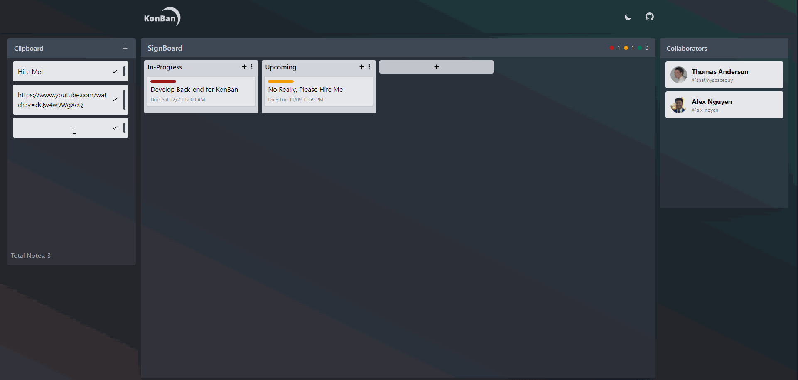

# KonBan (Prototype)

KonBan is a free-form signboard service based off of Trello to help users manage tasks towards a larger goal with an interactive interface. Users can set deadlines, assign priority levels, and move tasks between columns like one would on a kanban board. Currently, KonBan is built solely as a front-end prototype for the full-stack app being built.

The site is hosted [here](https://vibrant-villani-fb33a6.netlify.app/) using Netlify!
